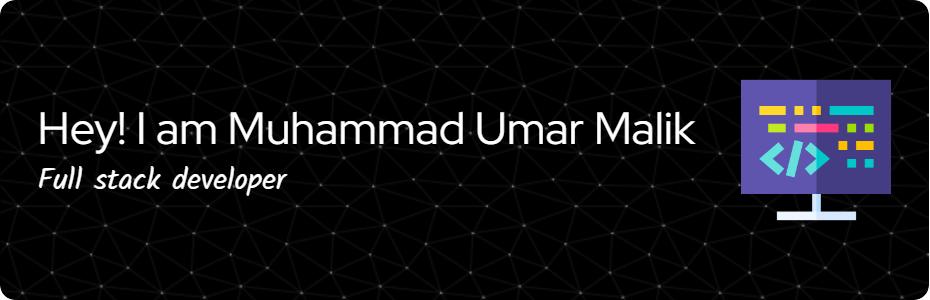

<!-- Profile Banner -->

<h1 align="center">Hey there 👋, I'm Muhammad Umar Malik</h1>
<h3 align="center">🚀 Full Stack Engineer | React.js • React Native • Node.js • Adonis.js • PostgreSQL • Tailwind CSS</h3>

<!-- Typing Animation -->

  

---

## 👨‍💻 About Me
I’m a **passionate Full Stack Developer** from Pakistan, helping **startups, entrepreneurs, and agencies** bring their ideas to life.  
I specialize in **React.js**, **React Native**, **Node.js**, **Adonis.js**, and **PostgreSQL** to create **high-performing** and **user-friendly** applications.

- 🔭 **Currently working on:** [Blood Stream](#) – A real-time health-tech solution  
- 🌱 **Currently learning:** React Native & Nest.js  
- 🤝 **Open to collaborate on:** B2B SaaS & Mobile Apps  
- 💬 **Ask me about:** Adonis.js, Nest.js, React Native  
- 📫 **Reach me at:** umarmalik.cs711@gmail.com  

---

## 🛠 Tech Stack

  
  
  
  
  
  
  
  

---

## 🚀 Featured Projects

### 🔹 [Blood Stream](#)
**Tech:** React Native, Nest.js, Firebase  
- Mobile app for **real-time blood donation tracking** and volunteer management.  

---

### 🔹 [Bidders Pro Website](https://bidderspro.com)  
**Tech:** Next.js 15, React 19, TypeScript, Tailwind CSS, PostgreSQL  
- Built a **B2B automation platform** with a dynamic booking system and SEO optimization.  

---

### 🔹 [LinkedIn Job Scraper Desktop App](https://github.com/bidderspro/linkedin-job-crawler)  
**Tech:** Node.js, Express.js, Electron.js  
- Automated LinkedIn job search with filtering by **job title** and **location**.  

---

### 🔹 [Loan Calculator App](https://loan-calculator-app-topaz.vercel.app/)  
**Tech:** React.js, Tailwind CSS  

  

---

### 🔹 [ClickSmart Landing Page](https://click-smart-gules.vercel.app/)  
**Tech:** Next.js, Tailwind CSS  

  

---

### 🔹 [Appliance Quick Repair Fix](https://www.appliancequickrepairfix.com/)  
**Tech:** NEXT.JS,Tailwind CSS, Custom Theme  

  

---

## 📊 GitHub Insights

  
  

---

## 🌍 Connect With Me

  
  
  

---

💡 *"Turning innovative ideas into scalable, high-performance digital products that make an impact."*
